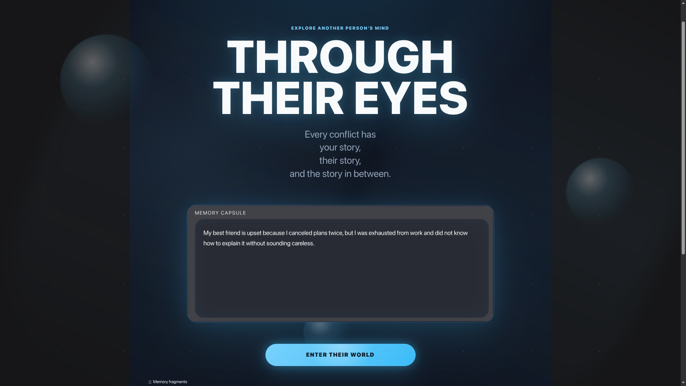
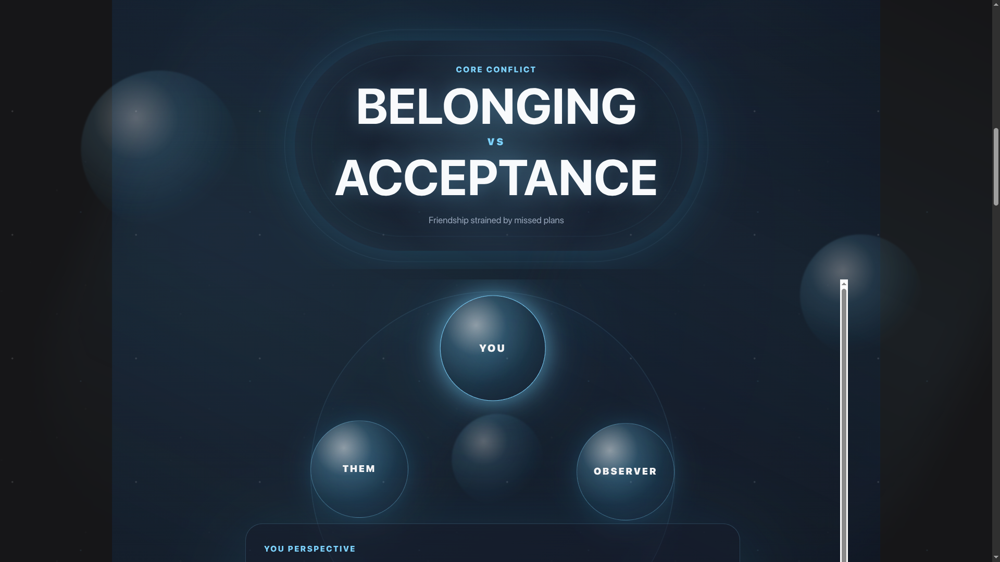
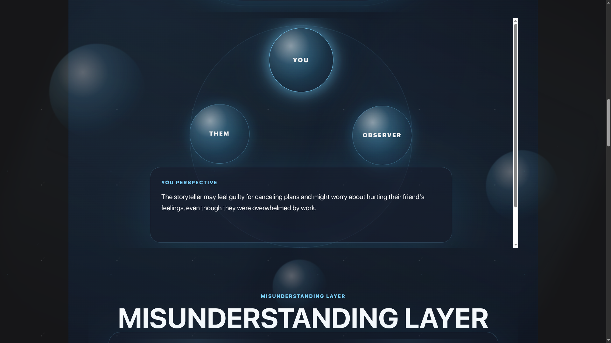
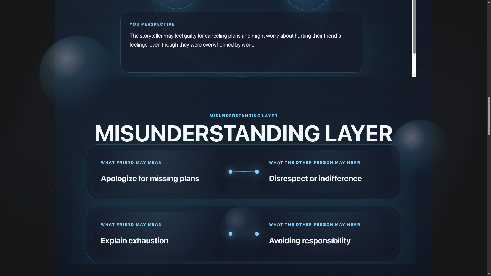
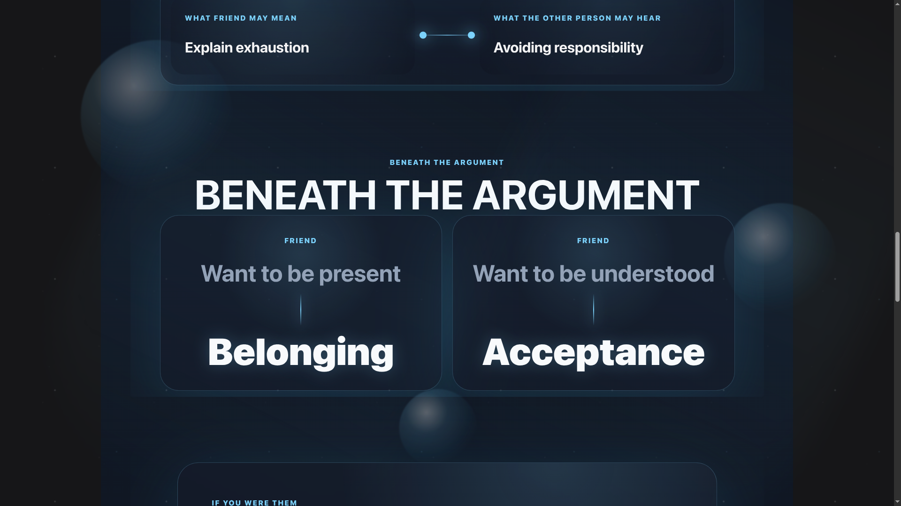
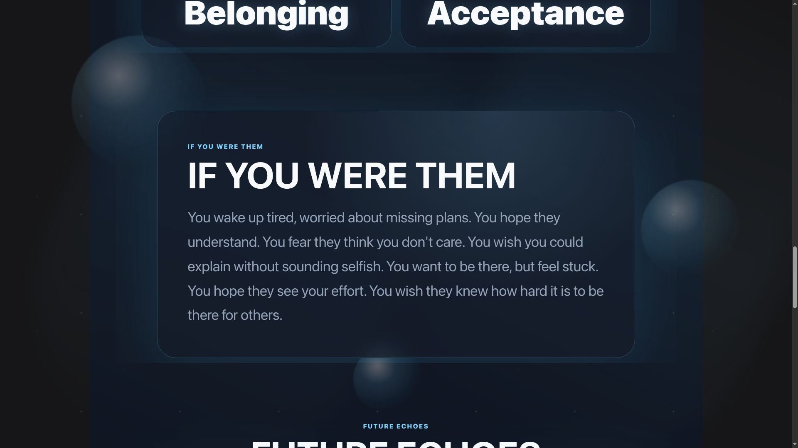
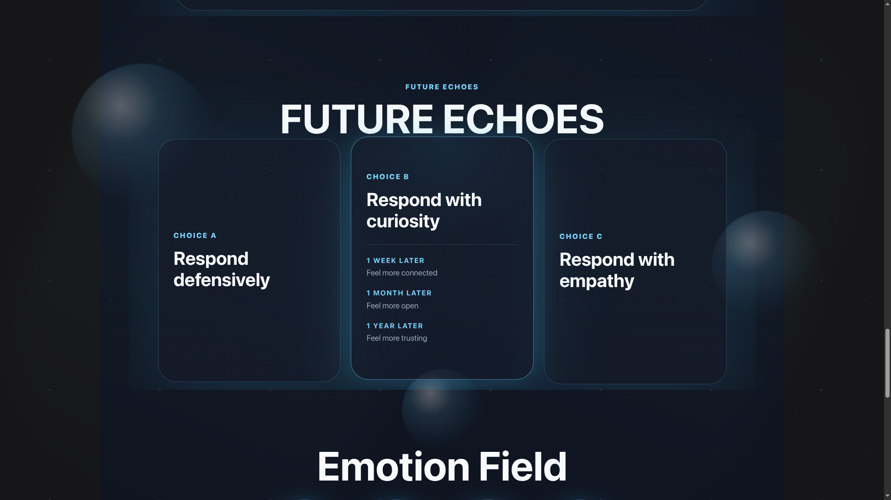
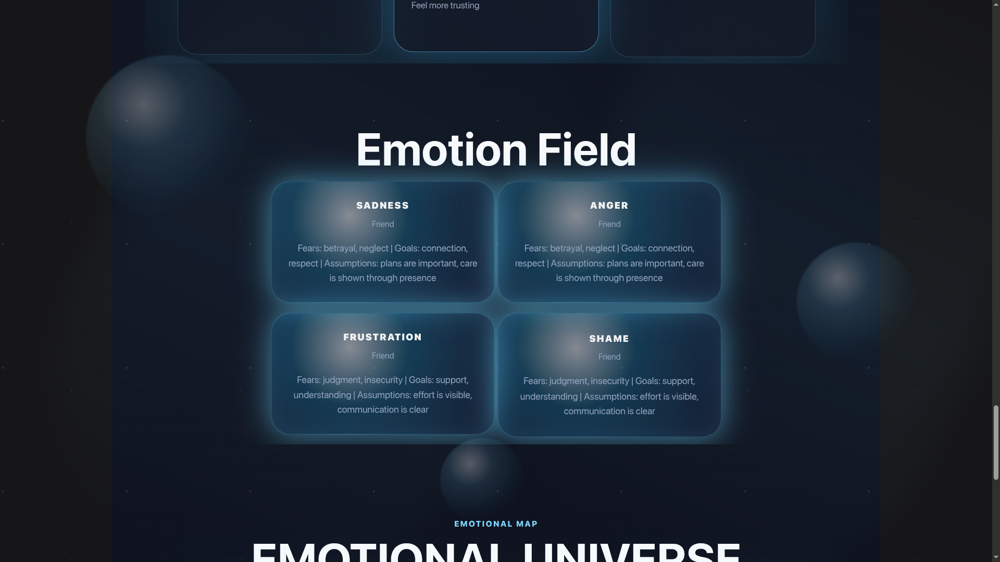
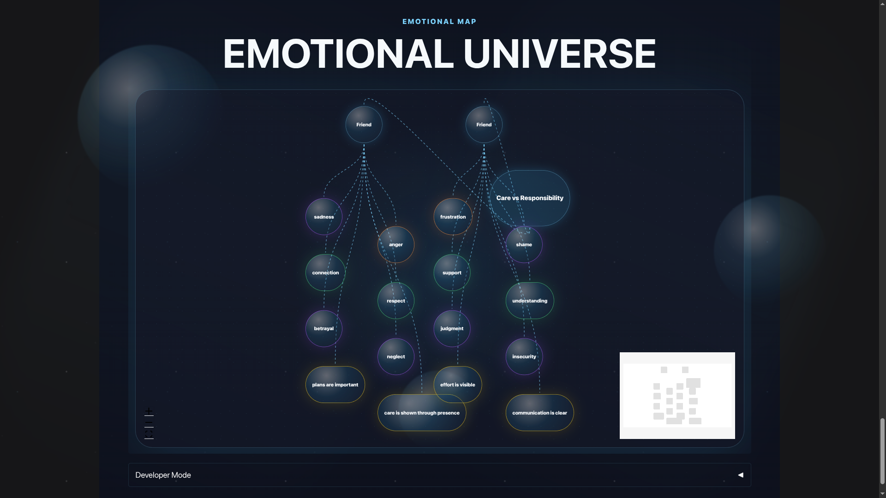

# 🫂 Through Their Eyes

**An AI-powered empathy simulator for seeing the story inside a conflict.**

Every conflict has three stories:

- Your story
- Their story
- The story in between

Through Their Eyes turns a short conflict description into an immersive emotional world. It does not give therapy, diagnose anyone, judge either side, or tell users what to do. Its purpose is simpler and more human: help someone pause long enough to wonder, *"What might this feel like from the other side?"*

---

## 🔗 Links

- **Live Space:** https://huggingface.co/spaces/build-small-hackathon/through-their-eyes-empathy-simulator
- **Demo Video:** https://x.com/ThoratAbhi35944/status/2066523239820718583
- **GitHub Repository:** https://github.com/Abhinay2007/Hugging_Face_Hackthon
- **Social Post:** https://www.linkedin.com/posts/abhinay-thorat-a406642ba_ai-artificialintelligence-machinelearning-ugcPost-7472261279416602625-paWL/

---

## ✨ What It Does

Users enter a real-world conflict, such as:

> My father wants me to become an engineer, but I want to start a business.

The app generates an empathy experience with:

- **Core Conflict Compression:** turns long conflict descriptions into emotional archetypes like `Security vs Freedom`.
- **Perspective Explorer:** shows the user's view, the other person's view, and a neutral observer view.
- **Misunderstanding Layer:** reveals what each person may mean versus what the other person may hear.
- **Hidden Needs:** maps surface positions to deeper needs such as security, freedom, trust, or respect.
- **Future Echoes:** explores how defensive, curious, or empathic responses may unfold over time.
- **Emotional Universe:** visualizes emotions, fears, goals, and assumptions as a constellation.
- **If You Were Them:** a short narrative that helps the user temporarily inhabit the other person's emotional world.

---

## 🎯 Why It Matters

Most AI tools try to answer the user.

Through Their Eyes tries to widen the user's view.

Conflict often gets stuck because people argue about positions: career choices, chores, tone, deadlines, money, plans. Underneath those positions are usually needs: safety, independence, respect, belonging, recognition, trust.

This project helps users see that hidden layer without taking sides.

---

## 🧠 Design Philosophy

The interface is intentionally not a dashboard. It is designed to feel like entering another person's emotional world:

- Floating perspective planets
- Glowing emotion bubbles
- A constellation-style emotional map
- Cinematic dark UI
- Minimal text, high emotional focus

The goal is a judge moment:

> Oh wow. I never thought they might see it that way.

---

## 🛠 Tech Stack

- **Frontend:** Gradio Blocks, custom CSS, custom JavaScript
- **Backend:** Python, Pydantic, NetworkX
- **Model Runtime:** Transformers
- **Model:** Qwen3 local inference
- **Visualization:** React Flow-style emotional universe with fallback rendering
- **Deployment:** Hugging Face Spaces

---

## 🏆 Hackathon Track

**Track:** Thousand Token Wood

**Bonus Badges Targeted:**

- Off Brand
- Off The Grid

**Tags:** `thousand-token-wood`, `off-brand`, `modal`, `codex`

---

## 🚀 Running Locally

```bash
python app.py
```

For local model inference:

```bash
export LLM_PROVIDER=local
export MODEL_ID=Qwen/Qwen3-8B
export LOAD_IN_4BIT=true
```

For lower-memory machines, use:

```bash
export MODEL_ID=Qwen/Qwen3-4B
```

---

## ⚡ ZeroGPU Notes

The app is prepared for Hugging Face ZeroGPU:

- `spaces` is included in `requirements.txt`
- Local Transformers generation is wrapped with `@spaces.GPU(duration=120)`
- GPU inference happens inside the decorated generation function
- The model client caches the tokenizer and model to avoid repeated initialization
- CPU fallback remains available when CUDA is not present

Recommended Space settings:

```text
SDK: Gradio
Hardware: ZeroGPU
```

Recommended environment variables:

```bash
LLM_PROVIDER=local
MODEL_ID=Qwen/Qwen3-8B
LOAD_IN_4BIT=true
PYTORCH_CUDA_ALLOC_CONF=expandable_segments:True
```

---

## 🧪 Development Journey

This project was built and refined through fast local and cloud iteration.

- **OpenAI Codex:** accelerated implementation, UI iteration, schema design, and debugging.
- **Modal:** used to experiment with model behavior and infrastructure options.
- **Local AI Development:** final testing was performed on an NVIDIA RTX 5060 Ti 16GB GPU to keep the project grounded in accessible small-model inference.

---

## 📷 Screenshots











---

## ❤️ Final Thought

Through Their Eyes is not about winning an argument.

It is about discovering the emotional world the argument is hiding.
